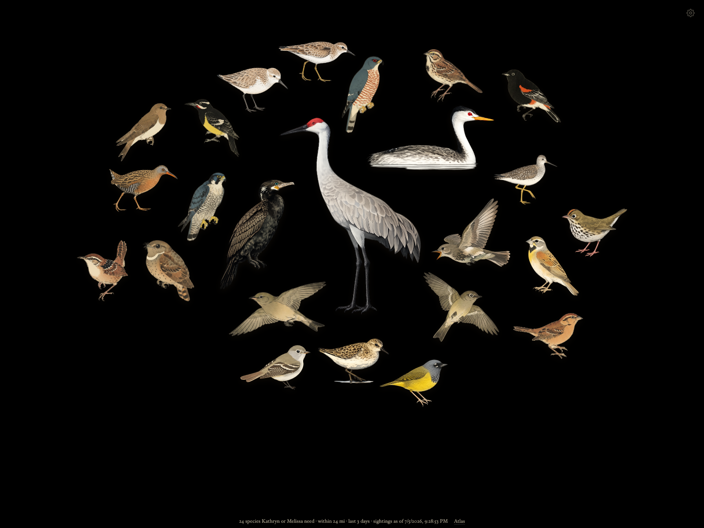

# Needs Nearby — a local second-screen bird board



A kachō-e-style bird board for a spare tablet, iPad, or any second screen. It
shows birds seen in the last 30 days
within ~30 miles of a point you choose (ours is the Hwy 86/83 intersection,
Franktown/Castle Rock, CO) that are still a **need** for someone in your
household — the people, like the location, are set in `config.json` — arranged
as a spiral collage on warm cream "mulberry paper," each bird drawn **to scale
by body length**: a Sandhill Crane towers over a kinglet. Tap a bird for a map
+ table of its recent local sightings.

**Everything stays local.** The only thing the running app talks to is the
eBird API (plus map tiles on the detail page) — no Wikipedia, no image service,
no analytics, nothing regenerated at display time. Life lists, settings, and
images never leave your machine.

- [About this branch](#about-this-branch)
- [Requirements](#requirements)
- [Run it](#run-it-every-time) · [One-time setup](#one-time-setup)
- [The Atlas](#the-atlas) · [Settings](#settings-the--cog) · [Life lists](#updating-the-life-lists)
- [Images & attribution](#images-bundled-woodblock-art-silhouettes-for-the-rest)
- [Troubleshooting](#troubleshooting)
- [Files](#files) · [License](#license)

## About this branch

This is a variant of Teddy Warner's
[AvianVisitors](https://theodore.net/projects/AvianVisitors/) built by
[Breakerfallen](https://github.com/Breakerfallen). AvianVisitors listens to a
microphone and collages the birds it *hears*; this branch keeps the collage,
the atlas, and the woodblock aesthetic, but draws from **eBird sightings
filtered by your household's needs lists** — it shows the nearby birds you
*haven't seen yet*. New here: the life-list/needs model with CSV upload,
to-scale sizing by body length, silhouette-mask packing and hit-testing,
fresh-arrivals-fly semantics driven by eBird polling instead of a random roll,
a true-black dark mode, and an in-app art uploader with per-image attribution.
Shared as-is: a personal project, maintained as we use it.

## Requirements

- **Server:** any machine with **Python 3.9+** — no packages to install, the
  standard library is enough. Written on macOS; runs anywhere Python does (the
  printed `.local` address is Mac/Bonjour flavored — on other systems use the
  printed IP address instead).
- **Display:** anything on the same Wi-Fi with a web browser — tablet, spare
  laptop, TV browser.
- **A free eBird API key** (see setup below).

## Run it (every time)

```
cd ipad-display
python3 server.py
```

It prints the address to open on the display device, e.g. `http://your-mac.local:8080`.
Leave the Terminal window open while you're using it. `Ctrl-C` stops it. Nothing
to install — it uses only what ships with macOS Python 3.

## One-time setup

1. **Copy `config.example.json` to `config.json`** and fill it in: your eBird
   API key (free, instant: https://ebird.org/api/keygen — or set the
   `EBIRD_API_KEY` environment variable), your center point (`lat`/`lng` +
   `place_label`), and your household under `"people"` (id → display name; any
   number of people, and the whole UI builds itself from this list).
   `config.json` is gitignored so keys and personal details stay on your machine.
2. **Same Wi-Fi** for the Mac and the display device (tablet, spare laptop, TV
   browser — anything with a web browser), then open the printed address on it.
3. **(Optional) kiosk feel:** on an iPad, Safari → Share → *Add to Home Screen*,
   then Settings → Accessibility → Guided Access to lock it to the page; Android
   tablets have similar "pinned app" modes. Keep the device plugged in.

The collage ships with just the birds — no labels. **Hover a bird** (or tap on a
touchscreen — a second tap opens it) and it highlights while a pill along the bottom names it and shows who
needs it, the most-recent nearby hotspot, its distance in miles, and how long
ago it was seen. Move off and the names disappear again. If you'd rather read
the board at a glance, ⚙ → **Bird names** letters them on in a handwritten face —
**nested** along each bird's own back or belly, or **below** it as a caption.
Either way the packer reserves room for the lettering, so a name never lands on
a neighbour.

The collage keeps itself current, and the server polls eBird **at most once an
hour** — every page load in between is served instantly from a local cache
(`data/cache_nearby.json`), which also survives restarts. The footer shows when
the sightings were last pulled.

## The Atlas

The **Atlas** link (footer) is the reference view, patterned on AvianVisitors':
a uniform grid of **every species ever recorded here** by the app, each card
with its art, scientific name, first/last-seen dates, and need dots (one color
per person, hover to see whose). Filter **Needs / All seen here**; sort **Most
recent / A–Z / By size**. It accumulates in `data/atlas.json` with each fresh
eBird pull. Tap a card for the species detail page.

The main collage stays deliberately clean by default — no heading, no badges,
just birds (names are opt-in, see the ⚙ below); the who-needs-it chips live on
the species detail page and the Atlas.

**Fresh arrivals fly.** Most birds are drawn perched. A bird is shown in its
**in-flight** pose while it's a fresh arrival — first recorded by the app's
hourly polling within the flight window set in the ⚙ (24 hours by default), or
seen again after not having been seen for 14+ days — so a newly-found (not "continuing") bird stands out mid-flight. It
only flies if a flight illustration exists for it (all 249 bundled species have
one; uploads are perched unless you add a flight image). The app ships with a
clean baseline where everything currently known counts as continuing, so flight
appears organically as genuinely new species turn up. If the app itself has been
off for longer than that 14-day window, the catch-up poll can't tell "the bird
came back" from "nobody was watching" — so it re-baselines instead of putting the
whole flock in the air at once.

## Settings (the ⚙ cog)

Tap the **cog** (top-right of the atlas) — or open `/settings.html` — for all
controls in one place:

- **Distance** — radius from your configured center point, in miles. eBird caps
  this at 31 mi (50 km). Changing it re-queries eBird at the new radius.
- **Days out** — 1 / 3 / 7 / 30 days; how recent a sighting must be to show.
- **Whose needs** — any one person, or everyone.
- **Bird names** — **Off** (default) · **Below** · **Nested**. Both on-settings
  write the bird's common name in **Caveat** (a handwriting face, SIL OFL,
  bundled in `app/vendor/fonts/` — no webfont call).
  **Below** parks a caption under the tile. **Nested** sets the name *on* the
  bird — the baseline is traced from a run of its own outline (a stretch of back
  or belly), smoothed, and pushed just off the ink, then the name is set along
  that curve with SVG `<textPath>`, so each glyph stands on its own local
  tangent and the writing bends with the drawing. This follows the treatment
  described at
  [theodore.net/projects/AvianVisitors](https://theodore.net/projects/AvianVisitors/).
  Where a run is shorter than the name, the line carries on past it along the
  end tangents — a run has to point, not contain. A baseline that would swing
  too far end to end is refused rather than let the name curl round a tail. A bird offering no run worth
  writing along falls back to the caption, so nothing goes unnamed, and the
  whole inked band is proved clear of the silhouette before a placement is
  accepted. Either way the lettering's box is reserved during packing. Birds
  drawn smaller than 56 px stay bare — measured as √(w×h), so an upright owl
  isn't punished for being narrow. Hover still shows the full pill.
- **Fresh arrivals fly** — **Never** · **24 h** (default) · **3 days** ·
  **7 days**: how long a newly-arrived bird is drawn in flight instead of
  perched. *Never* keeps the whole flock perched. (What counts as an *arrival*
  is separate — see below.)
- **Appearance** — Light (warm cream) or Dark. Dark uses a true-black
  background, which turns OLED pixels fully off to save battery on a tablet; text is a
  soft warm gray at AA contrast, silhouettes invert to light, and the detail
  map switches to a dark basemap (CARTO Dark Matter, built on OpenStreetMap
  data — free, no key). Ships Light by default.

All persist (in `data/settings.json`), so a kiosk keeps them across refreshes.
The day buttons on the atlas itself stay in sync with this.

## Your own sightings and notes (the **Mine** tab)

Each species' detail page has two tabs. **Nearby sightings** is the map and table
of recent local eBird reports. **Mine** is your own record of that bird: every
time you've logged it, where, how many, and whatever you wrote in the field —
plus a notes box for anything you want to keep.

**Getting your sightings in.** eBird's API can't do this: the key identifies the
*application*, not you, and every endpoint returns public regional data, so
there's no route to your own history through it. What works is the export —
*My eBird → [Download my data](https://ebird.org/ebird/downloadMyData)* — which
generates a CSV of every observation you've ever submitted. Upload it on the ⚙
page under **Upload eBird sightings export**. It saves to
`data/sightings_<id>.json` and, like everything else here, never leaves the
machine.

That file is one row per *observation*, so it carries what a life list can't:
dates, places, counts, and your own **Observation Details** — which is why it's
worth having as well as the life list rather than instead of it. The life list
still drives what counts as a need; this only fills the Mine tab.

**Notes** save themselves a moment after you stop typing (a kiosk has no obvious
moment to press Save), and live in `data/notes.json` keyed by species. Clearing
the box deletes the note.

## Updating the life lists

Everyone works the same way: each person has a **life list**, and a bird shows
on the board when it's *missing* from a life list (that makes it a need for
that person).

To update a list, tap the ⚙ cog (or open `/settings.html`):

- **Upload eBird life list CSV** — the normal path. In eBird go to *My eBird →
  Life List → Download (csv)*, then upload the file here. It replaces that
  person's entire list. Do this whenever a list changes. (Both the current
  export format and the older "Common - Scientific" single-column format work.)
- **Search a bird** for one-off fixes: **✓ &lt;name&gt; saw** marks it seen
  (drops it off the board for that person); the **×** next to a bird on a list
  removes it, making it a need again.

Changes save to `data/life_<id>.json` immediately; the board picks them up on
its next refresh. Works from the display device or the Mac. Until a person's list has
been uploaded, the board shows **no** needs for them (and says so in the
footer) rather than flagging every bird.

## Images: bundled woodblock art, silhouettes for the rest

**249 kachō-e bird illustrations** (perched + in-flight) come from the
[AvianVisitors](https://github.com/Twarner491/AvianVisitors) project by Teddy
Warner — the same art style that inspired this app — used under CC BY-NC-SA 4.0
(attribution shown on the Atlas page; see `images/CREDITS.md`). They aren't
duplicated in this folder, because the same files already live in this
repository under `avian/assets/illustrations/`; after cloning, copy them in
once with

```
python3 fetch_bundled_art.py && python3 build_credits.py
```
Any species without a bundled illustration (AvianVisitors' set is San Diego
coastal, so it misses some Colorado migrants) falls back to a **sumi-ink
silhouette typed to its family** (heron, duck, hawk, warbler, …), scaled to real
body length and generated locally.

> **After adding any batch of art, audit the size table** — new illustrations
> bring new species, and one without a row draws at the generic 8″ default:
> `python3 build_species_data.py --audit`. See
> [How body length / shape is set](#how-body-length--shape-is-set).

Illustrations resolve by scientific-name slug (`images/genus-species_perched.png`)
so subspecies sightings and eBird's genus renames both map correctly. Both the
bundled art and your uploads are cropped tight to the bird (uploads are
auto-cropped in the browser at upload time), so every bird fills its tile and
sizes stay consistent across the flock — a bird floating in a padded frame would
otherwise render too small next to a tightly-cropped one.

### Attribution

Every image's author and license is tracked in `data/image_credits.json`
(seeded by `build_credits.py`), all **CC BY-NC-SA 4.0**:

- the **bundled scientific-name-slug art** is by **Teddy Warner**
  ([AvianVisitors](https://github.com/Twarner491/AvianVisitors));
- the **species-code-named images that ship with this branch** are by
  **[Breakerfallen](https://github.com/Breakerfallen)**;
- anything **you add yourself** (the ⚙ uploader or `build_images.py`) is
  credited to you — set `owner_name` in your config.json.

The credit shows on each species' detail page under its image, and a summary
sits at the foot of the Atlas. Uploads and deletes update the registry
automatically; see `images/CREDITS.md` for the full breakdown.

### Uploading your own art (⚙ → Bird images)

The surest way to fill a gap (or replace art you don't like) is to upload your
own. On the settings page, the **Bird images** card lists every species recorded
here that's still on a silhouette (needs first, with need dots), each with a
**Perched** and **In flight** slot — tap *Upload* and pick a PNG/JPEG/WebP.
There's also a search box to add art for any species. Perched shows on the
collage; in-flight shows on the detail page. Uploads are keyed by eBird species
code (`images/<code>_perched.png`), take precedence over the bundled art, and the
board picks them up on its next refresh. Use *Replace* / *×* to change or remove
one.

To fill the **gaps** (the species that fall back to silhouettes) with your own
kachō-e art, one-time. Start the server, then in another Terminal:

```
python3 build_images.py                # illustrate the birds showing nearby now
python3 build_images.py --perched-only # skip the in-flight pose (half the work)
```

Pick a provider (set `"image_provider"` in `config.json`, or let it auto-pick):

- **`pollinations`** — **free, no key, no signup** (default when no key is set).
  Uses the Flux model. Anonymous use is rate-limited to ~1 image / 15 s, so the
  script throttles itself and a full nearby set takes a few minutes. Because Flux
  can't do transparency, birds sit on a paper-matched tile rather than floating.
- **`openai`** — `"openai_api_key"`; gpt-image-1 with a true transparent
  background (cleanest float on the paper). A few cents per image.
- **`gemini`** — `"gemini_api_key"` + `"image_provider": "gemini"`; Imagen 3.

It saves PNGs into `images/` and never regenerates them. The running app only
*reads* those files, so it still makes no calls except eBird. Skip this entirely
and the silhouettes stay. Because it only illustrates what's actually nearby, the
set stays small.

## How body length / shape is set

`data/species_data.json` is a local table of ~365 species (body length in inches
+ silhouette family), built by `build_species_data.py`. The app reads it
directly — lengths are never fetched. A bird not in the table falls back to a
generic songbird silhouette at a default 8″ until you add a row and re-run
`python3 build_species_data.py`.

### Audit the table after adding art

**Run this every time you add a batch of illustrations.** A bundle always brings
species the table has never heard of, and they will quietly draw at 8″ — a
Red-necked Grebe the size of a Semipalmated Plover:

```
python3 build_species_data.py --audit
```

It lists every species the atlas has recorded that has no row, as paste-ready
lines. Fill in a real body length (bill to tail) and a shape from
`app/vendor/silhouettes/`, add them to `SPECIES` in the script, then re-run it
without `--audit` to rebuild the table.

The fallback means the board never breaks on an unlisted bird — but it is
invisible on screen, and on a collage whose whole premise is drawing to scale, a
wrong size reads as fact rather than as a gap. That is why it is worth a
deliberate pass rather than waiting to notice.

## Troubleshooting

- **"No eBird API key yet" on startup** — copy `config.example.json` to
  `config.json` and set `ebird_api_key` (or export `EBIRD_API_KEY`). Keys are
  free and instant: https://ebird.org/api/keygen
- **Port 8080 already in use** — change `"port"` in `config.json`, or find the
  old process with `lsof -ti:8080 | xargs kill`.
- **The board is empty** — usually by design: no life list uploaded yet (the
  footer says so — a person with no list gets no needs flagged, so the board
  isn't flooded), or genuinely nothing needed was reported in the current
  distance/days window. Widen either in the ⚙ settings.
- **Distance won't go past 31 mi** — that's eBird's hard cap (50 km) on the
  nearby-observations API, not a setting.
- **Sightings look stale** — the server polls eBird at most once an hour by
  design; the footer shows when the data was last pulled. Restarting the server
  does *not* force a refetch (the cache is on disk); delete
  `data/cache_nearby.json` if you really need an immediate pull.
- **A bird renders at the wrong size** — its species is probably missing from
  `data/species_data.json` (rare vagrants fall back to a generic 8″ songbird).
  Add a row and re-run `python3 build_species_data.py`.
- **Uploaded art floats small in its tile** — the uploader auto-crops
  transparent margins, but opaque (JPEG) images can't be cropped safely; use a
  transparent PNG cropped tight to the bird.

## Files

- `server.py` — the local server: serves the app, proxies eBird, edits the lists
- `config.json` — your eBird key, people, location, radius, port (copy from
  `config.example.json`; gitignored — never commit it)
- `app/` — the pages (`index.html` collage, `atlas.html` atlas, `species.html`
  detail, `settings.html` lists & settings, `app.js`, vendored Leaflet,
  silhouettes + the Caveat font used for optional bird names)
- `data/` — the life lists, your sightings export and per-species notes,
  `settings.json`, the species length/shape table, the hourly sightings cache,
  and the cumulative atlas registry
- `images/` — local bird images (silhouettes always; woodblock PNGs if you build them)
- `build_species_data.py` / `build_silhouettes.py` — regenerate the table and
  silhouettes; `build_images.py` — optional kachō-e illustrations

## License

**CC BY-NC-SA 4.0** ([full text](LICENSE)) for the whole project — code and
illustrations alike — matching the parent
[AvianVisitors](https://github.com/Twarner491/AvianVisitors) repository it
branches from. Attribution required, non-commercial use only, share-alike.
Illustration credits are per-image: see [Attribution](#attribution) above and
`images/CREDITS.md`.
